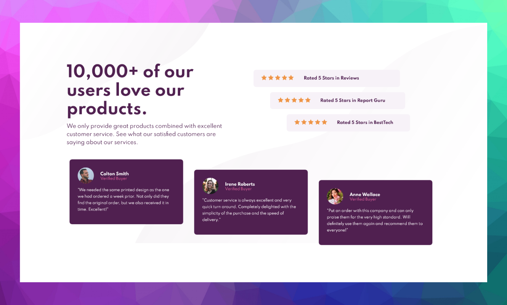
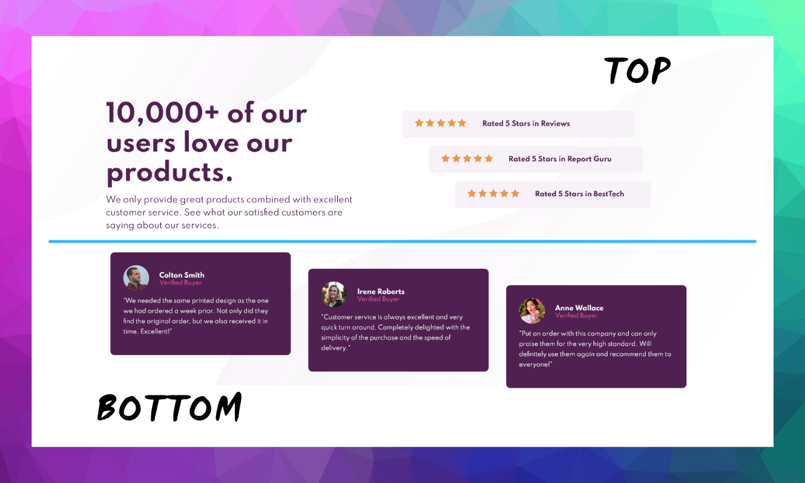
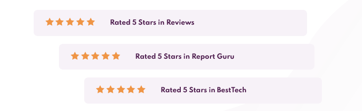

# Frontend Mentor - Social proof section solution

This is a solution to the [Social proof section challenge on Frontend Mentor](https://www.frontendmentor.io/challenges/social-proof-section-6e0qTv_bA). Frontend Mentor challenges help you improve your coding skills by building realistic projects. 

## Table of contents

- [Overview](#overview)
  - [The challenge](#the-challenge)
  - [Screenshot](#screenshot)
  - [Links](#links)
- [My process](#my-process)
  - [Built with](#built-with)
  - [What I learned](#what-i-learned)
  - [Continued development](#continued-development)
  - [Useful resources](#useful-resources)
- [Author](#author)

## Overview

### The challenge

Your challenge is to build out this social proof section and get it looking as close to the design as possible.

You can use any tools you like to help you complete the challenge. So if you've got something you'd like to practice, feel free to give it a go.

Your users should be able to:

- View the optimal layout for the section depending on their device's screen size

### Screenshot

Screenshot of the desktop page 1440px x 800px 


### Links

- Live Site URL: [Live Site Here](https://social-proof-section-felipaodev.netlify.app/)

## My process

It was carried out mainly with two sections, one called top and the other bottom, in this way the content of it can be structured more easily. 



Inside the two containers, the content was represented as the main informational banner at the top next to the rating stars, this was organized thanks to FlexBox. 

For the handling of the rating stars I had a problem since they are one run of the other, the solution that I was able to discover was an independent container to generate the left side margin to generate the desired effect. 



At the time I was developing each part, I verified in the Media Query section that everything was organized as I wanted at the 375px cut-off point, to avoid future errors. 

Finally, in the lower section, the cards were created to place the information of the verified buyers, all from containers and the management of classes, they were structured from FlexBox and the effect was made in the same way as the rating stars. 

### Built with

- Semantic HTML5 markup
- CSS custom properties
- Flexbox

### What I learned

I learned to manage a project from scratch from an idea raised by the challenge, challenging myself to make the proposed design, making use of my skills, I was able to learn how to use flexbox for the structure of the project in a responsive way, it helped me to take away the fear of carrying out projects within web development. 

I was able to learn how flexbox allows me to adapt more easily to different screens thanks to the properties that are handled, at the beginning it can be difficult but little by little you understand how flexbox works. 

```css
.top{
  margin-top: 125px;
  display:flex;
  justify-content: space-between;
  flex-wrap: wrap;
  margin-bottom: 40px;
}
```
I was able to establish the easiest way to develop a responsive page, taking into account the cutoff points of a screen each time I went to a part of the page that was important, made the respective change in the media query part and thus avoided problems to adapt it to the type of screen. 


### Continued development

The next step I want to do is to be able to practice my skills related to frontend development, taking into account the properties that best suit me, I want to learn the use of css grid, in order to do more frontend challenges. 

### Useful resources

- [css-tricks](https://css-tricks.com/) - Within this page there are large sections related to learning css, the one I used the most was the FlexBox section. 

## Author

- Frontend Mentor - [@Felipao-Dev](https://www.frontendmentor.io/profile/Felipao-Dev)

- GitHub - [Felipao-Dev](https://github.com/Felipao-Dev)
